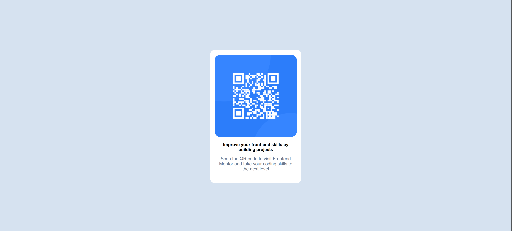

# Frontend-Mentor

## Nom du projet et description

COMPOSANT DE CODE QR Frontend Mentor

Ce projet consiste en la conception d'un composant de code QR avec HTML et CSS.

### Apercu



#### Le defi

Ce projet devait utiliser uncomposant flexbox pour creer u composant de code QR en respectant un palette de couleur predefinie. et des caracteristiques de RESPONSIVE precises.

#### Liens

- Site en lignen : https://anatoleabede.github.io/Frontend-Mentor/
- Depot GitHub : https://github.com/anatoleabede/Frontend-Mentor

### Ce que j'ai appris

Lors de realisation de ce projet, j'ai aborde beaucoup de notions des langages CSS et HTML approfondissant ainsi mes connaissances sur ceux-ci. Ci bas les notions sur les quelles j'ai butte et comment je les surmonte :

# HTML :

Je souhaitais centrer mon composant de code QR et pour le faire, j'ai eu l'idee qui me semblait brillante sur le coup d'utiliser un header vide a qui j'ai defini une taille dans mon style.css. Mais le resultat ne tenait pas avec la modification de la taille des ecrans.

# CSS :

- Je souhaitais centrer mon image dans mon main et pour le faire j'ai cru qu'il etait bo de fixer une hauteur en px et une largeur en %. Ci-dessous le code utilise :

```css
.flexbox img {
  width: 90%;
  height: 350px;
}
```

Puis en approfondissant les recherches, j'ai appris qu'il ne faut jamais fixer deux dimensions independantes sur une image avec un ratio naturel a respecter, sinon elle se deforme. Ci dessous le code correct:

```css
.flexbox img {
  width: 100%;
  height: auto;
  max-width: 350px;
}
```

- Je souhaitais centrer une boite dans mon body (c'est ce probleme que j'ai decrit plus haut dans la partie HTML) et pour le faire j'ai defeni une taille au header:

```css
header {
  height: 150px;
}
```

Mais comme je l'ai dit plus haut, cette solution n'est qu'un bricole, rien de robuste. Des recherches approfondies m'ont permis d'arriver a la suppression du header et a l'utilisation de ceci :

```css
body {
  display: flex;
  align-items: center; /* centrer verticalement*/
  min-height: 100vh; /* prendre toute la hauteur de la fenetre */
  justify-content: conten; /* centrer horizontalement*/
}
```

- Je definissais la taille de mes textes en pixels (px) et des recherches plus poussees m'ont fait comprendre qu'il est preferable de la definir en "rem".

### Technologies utilisees

- HTML5 semantique
- CSS3 (Flexbox)

### Auteur

- GitHub -[@anatoleabede].
